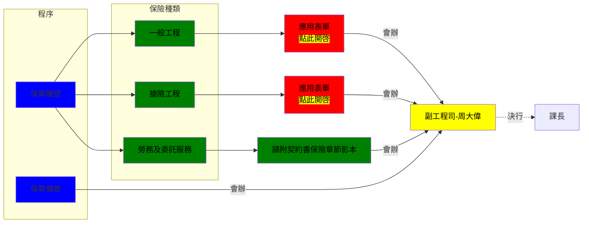

---
{"dg-publish":true,"dg-permalink":"廠商承攬工程注意事項","permalink":"/廠商承攬工程注意事項/"}
---

# 契約內重要事項

## 人員審查
- [[work/契約/人員審查\|人員審查]]需附文件列表
- 契約內特殊規定
	- [[work/契約/人員審查#品管人員\|品管人員]]
		- 依據經濟部水利署廠商品質管制規定第5條第3項第1款規定
			- 廠商應於<mark style="background: #FF5582A6;">開工前</mark>，將品管人員登錄表（表八）、品管人員相關學經歷一覽表（表八之一）及資格證明文件影本函報執行機關審核，新台幣五千萬元以上工程應副知本署；品管人員異動時，亦同。

## 工程保險
- [[work/契約/工程保險\|工程保險]]相關規定

